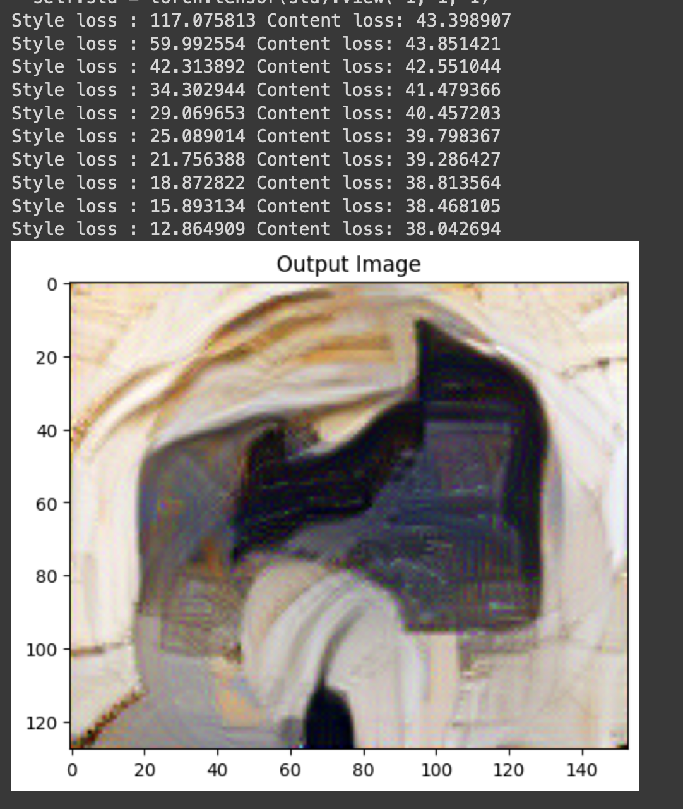
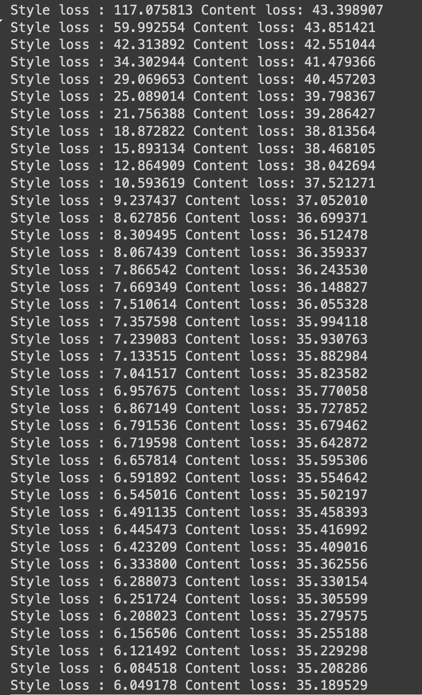
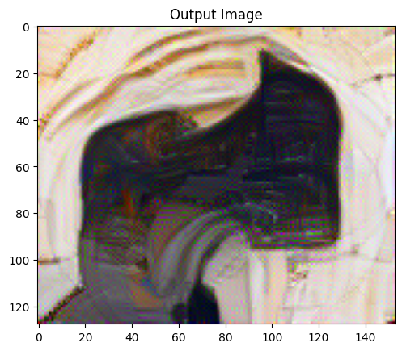
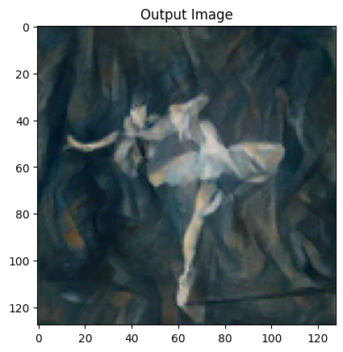
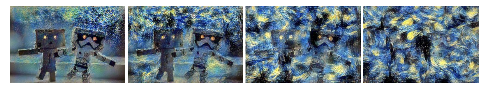

# Neural-Style-Transfer
Reimplementing the Existing Neural Style Transfer

With reference to the paper by [Gatys et al.](http://arxiv.org/pdf/1508.06576), we have reimplemented the basic Neural Style Transfer algorithm.

### What is the NST Algorithm?
The Neural Style Transfer (NST) algorithm takes the style from one image (the style image) and applies it to another image (the content image) using convolutional neural networks (CNNs), typically VGG-16 or VGG-19. Here we use VGG-19. The result is a new, stylized image that retains the content of the content image while adopting the style of the style image.

When Running for more epochs say 2000, the loss decreases gradually

Tested with some styles

### Changing the style_weights with const content_weight

Changing the style weight affects the amount of style in the final image, assuming the content weight remains constant. I incremented the style weight by factors of 10 (1e1, 1e2, 1e3, 1e4), while keeping the content weight constant at 1e5.

